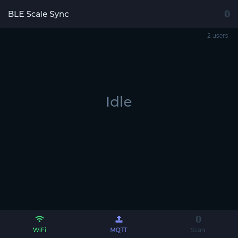

# ESP32 BLE Proxy

Use a cheap ESP32 board as a remote Bluetooth radio, communicating over MQTT. This lets you run BLE Scale Sync on machines without local Bluetooth: headless servers, Docker containers, or devices where the built-in radio has poor range.

::: tip Already running ESPHome?
If you already have an [ESPHome Bluetooth proxy](https://esphome.io/components/bluetooth_proxy.html) mesh for Home Assistant, the [ESPHome proxy transport](/guide/esphome-proxy) lets you reuse it without flashing a dedicated ESP32.
:::

The ESP32 scans autonomously for BLE advertisements and publishes results over MQTT. BLE Scale Sync matches scale adapters against the scan data, identifies users by weight, computes body composition, and dispatches to exporters. For scales that require a GATT connection, the server sends connect/write/read commands back to the ESP32 over MQTT. All scale-specific logic stays on the server.

## How It Works

```
┌───────┐  BLE   ┌────────┐  MQTT  ┌─────────────┐  MQTT  ┌────────────────┐
│ Scale │ ────── │ ESP32  │ ────── │ MQTT Broker │ ────── │ BLE Scale Sync │
└───────┘ advert └────────┘        └─────────────┘        └────────────────┘
          + GATT  MicroPython       e.g. Mosquitto          Docker / Node.js
```

**Broadcast scales** (weight in BLE advertisements):

1. The ESP32 continuously scans for BLE advertisements (~every 10s)
2. Scan results (names, services, manufacturer data) are published to MQTT
3. BLE Scale Sync reads weight from broadcast advertisement data
4. Body composition is computed and dispatched to exporters
5. Feedback (beep, display updates) is sent back to the ESP32 via MQTT

**GATT scales** (notification-based readings):

1. A matched adapter has no broadcast data, so the server sends a `connect` command
2. The ESP32 connects to the scale, discovers characteristics, and reports them
3. The server subscribes to notification topics and sends write commands (e.g. unlock)
4. Scale readings arrive as notifications, forwarded to the server via MQTT
5. The server sends a `disconnect` command when the reading is complete

## Supported Boards

Any ESP32 board running MicroPython with BLE support works. Tested on:

| Board                          | Price | Notes                                                                 |
| ------------------------------ | ----- | --------------------------------------------------------------------- |
| M5Stack Atom Echo (ESP32-PICO) | ~8€   | Tiny, no PSRAM, ~100 KB free RAM, I2S buzzer for beep feedback        |
| ESP32-S3-DevKitC               | ~12€  | Standard dev board, plenty of RAM                                     |
| Guition ESP32-S3-4848S040      | ~25€  | 480x480 RGB display, shows scan status and export results via LVGL UI |

The board is auto-detected from the chip family. Set `"board"` in `config.json` to override (e.g. `"guition_4848"` for the display board, `"atom_echo"` for the Atom Echo).



::: warning Not compatible
ESP32-C3 and ESP32-C6 boards use a different BLE stack in MicroPython and have not been tested. Classic ESP32 and ESP32-S3 are recommended.
:::

## Requirements

- An ESP32 board (see above)
- WiFi network accessible by both the ESP32 and BLE Scale Sync
- USB cable for initial flashing

::: tip MQTT broker is optional
BLE Scale Sync now ships with an embedded MQTT broker. If you don't already run one (Mosquitto, Home Assistant, etc.), just leave `broker_url` empty and BLE Scale Sync will start its own broker on port 1883. See [Embedded broker](#embedded-broker) below.
:::

### Host tools (install once)

```bash
pip install esptool mpremote
```

## Flashing the Firmware

### 1. Configure

Copy the example config and edit your WiFi and MQTT settings:

```bash
cd firmware/
cp config.json.example config.json
```

Edit `config.json`:

```json
{
  "board": null,
  "wifi_ssid": "MyNetwork",
  "wifi_password": "secret",
  "mqtt_broker": "192.168.1.100",
  "mqtt_port": 1883,
  "mqtt_user": null,
  "mqtt_password": null,
  "device_id": "esp32-ble-proxy",
  "topic_prefix": "ble-proxy"
}
```

### 2. Flash

Connect the ESP32 via USB and run the flash script:

```bash
# Full flash: erase -> MicroPython -> libraries -> app
./flash.sh

# Or just re-upload the app (fast iteration)
./flash.sh --app-only

# Or just reinstall MicroPython libraries
./flash.sh --libs-only
```

The script auto-detects the serial port. Override with `PORT=/dev/ttyACM0 ./flash.sh` if needed.

::: warning Windows users
`flash.sh` is a bash script and will not run in `cmd.exe` or PowerShell directly. Running `flash.sh` from CMD just opens it in your default editor. Use one of:

- **Git Bash** (simplest): install [Git for Windows](https://git-scm.com/download/win), then in Git Bash:
  ```bash
  cd firmware
  PORT=COM3 ./flash.sh
  ```
  Replace `COM3` with the port shown in Device Manager under _Ports (COM & LPT)_ when the ESP32 is plugged in.
- **WSL**: works, but you must attach the USB serial device into WSL with [`usbipd`](https://learn.microsoft.com/en-us/windows/wsl/connect-usb) first.
- **Manual flash from CMD/PowerShell**: `esptool` and `mpremote` are cross-platform Python tools, so you can run the equivalent commands by hand:

  ```powershell
  # 1. Erase + flash MicroPython (download the .bin from micropython.org for your board first)
  esptool.py --chip esp32s3 --port COM3 erase_flash
  esptool.py --chip esp32s3 --port COM3 --baud 460800 write_flash -z 0x0 ESP32_GENERIC_S3-SPIRAM_OCT-v1.27.0.bin

  # 2. Install MicroPython libraries
  mpremote connect COM3 mip install aioble
  mpremote connect COM3 mip install "github:peterhinch/micropython-mqtt@70b56a7a4aaf"
  mpremote connect COM3 mip install "github:peterhinch/micropython-async@68b5f01e999b/v3/primitives"

  # 3. Upload application files (run from firmware/)
  mpremote connect COM3 cp config.json :config.json
  mpremote connect COM3 cp boot.py :boot.py
  mpremote connect COM3 cp board.py :board.py
  mpremote connect COM3 cp board_esp32_s3.py :board_esp32_s3.py
  mpremote connect COM3 cp ble_bridge.py :ble_bridge.py
  mpremote connect COM3 cp beep.py :beep.py
  mpremote connect COM3 cp main.py :main.py
  mpremote connect COM3 reset
  ```

  Adjust `--chip`, the firmware filename, and `board_*.py` for your board (see the `configure_board()` cases in `flash.sh`).
  :::

::: tip Atom Echo / ESP32-PICO
Some boards need a slower baud rate. If flashing fails, edit `BAUD=115200` in `flash.sh`.
:::

::: tip ESP32-S3-4848 (display board)
This board requires custom LVGL MicroPython firmware. See [PORTING.md](https://github.com/KristianP26/ble-scale-sync/blob/main/PORTING.md) for build instructions:

```bash
cd drivers && ./build.sh guition_4848
```

:::

### 3. Verify

Check the serial console to confirm WiFi and MQTT connection:

```bash
mpremote connect /dev/ttyUSB0 repl
```

You should see:

```
BLE-MQTT bridge ready: ble-proxy/esp32-ble-proxy
```

Or check the MQTT status topic:

```bash
mosquitto_sub -h <broker-ip> -t 'ble-proxy/esp32-ble-proxy/status'
# Should print: online
```

## Configuring BLE Scale Sync

Add the `ble` section to your `config.yaml`:

```yaml
ble:
  handler: mqtt-proxy
  mqtt_proxy:
    broker_url: 'mqtt://192.168.1.100:1883'
    device_id: esp32-ble-proxy # must match config.json
    topic_prefix: ble-proxy # must match config.json
    # username: myuser                # optional, if broker requires auth
    # password: '${MQTT_PASSWORD}'    # optional
```

### Embedded broker

If you don't want to install Mosquitto (or you're already running BLE Scale Sync on a machine that can just host the broker itself), omit `broker_url` and BLE Scale Sync will start an embedded broker automatically. The ESP32 `config.json` should then point `mqtt_broker` at this machine's LAN IP.

```yaml
ble:
  handler: mqtt-proxy
  mqtt_proxy:
    # broker_url intentionally omitted, embedded broker will be started
    device_id: esp32-ble-proxy
    topic_prefix: ble-proxy
    embedded_broker_port: 1883 # default, override to avoid conflicts
    embedded_broker_bind: 0.0.0.0 # listen on all interfaces so the ESP32 can reach it
    username: myuser # required when bind is non-loopback
    password: '${MQTT_PASSWORD}' # required when bind is non-loopback
```

The internal BLE Scale Sync client always connects to the embedded broker over loopback (`mqtt://127.0.0.1:<port>`). The ESP32 connects over LAN, so make sure port `1883` (or whatever you pick) is reachable from the ESP32 and not blocked by a host firewall.

::: warning Authentication required on LAN
When `embedded_broker_bind` is `0.0.0.0` (or any non-loopback interface) the schema requires `username` + `password`. An unauthenticated broker on your LAN is rejected at config validation time. For single-host deployments where the ESP32 is not used, set `embedded_broker_bind: 127.0.0.1` to skip auth safely.
:::

::: tip When to pick which
Use the **embedded broker** for the simplest ESP32 proxy setup when you don't already have Mosquitto or Home Assistant. Use an **external broker** when you already run one, or when you want multiple services (Home Assistant, Node-RED, other IoT devices) to share it.
:::

::: warning Port conflict
If Mosquitto or another broker is already listening on port 1883, the embedded broker startup will fail with a clear message. Either stop the other broker, or set `embedded_broker_port` to a free port (e.g. `1884`) and update the ESP32 `config.json` to match.
:::

Then restart BLE Scale Sync. In continuous mode, the server maintains a persistent MQTT connection and reacts to scan results as they arrive.

::: tip Environment variable
You can also set `BLE_HANDLER=mqtt-proxy` as an environment variable instead of editing `config.yaml`.
:::

::: tip Setup wizard
`npm run setup` includes interactive mqtt-proxy configuration steps that generate the YAML above for you.
:::

::: tip Reusing your MQTT exporter broker
If you already have an MQTT exporter configured, the ESP32 proxy can use the same broker. Just make sure `device_id` and `client_id` don't collide.
:::

::: warning Security
The default `mqtt://` URL transmits data in plaintext, including body weight and composition data. On untrusted networks, use `mqtts://` with a TLS-enabled broker.
:::

## Docker Deployment

When using the ESP32 proxy, BLE Scale Sync does not need local Bluetooth at all. This means the Docker container requires no BlueZ, D-Bus mounts, or `NET_ADMIN` capability.

A dedicated compose file is included:

```yaml
# docker-compose.mqtt-proxy.yml
services:
  ble-scale-sync:
    image: ghcr.io/kristianp26/ble-scale-sync:latest
    container_name: ble-scale-sync
    volumes:
      - ./config.yaml:/app/config.yaml
      - garmin-tokens:/app/garmin-tokens
    environment:
      - CONTINUOUS_MODE=true
    restart: unless-stopped
    logging:
      driver: json-file
      options:
        max-size: '10m'
        max-file: '3'

volumes:
  garmin-tokens:
```

```bash
docker compose -f docker-compose.mqtt-proxy.yml up -d
```

Compare this to the standard [Docker deployment](/guide/getting-started#docker) which needs `network_mode: host`, `/var/run/dbus` bind mount, and `NET_ADMIN`. The mqtt-proxy approach avoids all of that because BLE communication happens on the ESP32, not the host.

## Firmware Files

::: details Firmware directory layout

| File                         | Purpose                                     |
| ---------------------------- | ------------------------------------------- |
| `config.json.example`        | WiFi + MQTT config template                 |
| `flash.sh`                   | One-command flash script                    |
| `boot.py`                    | Stub (WiFi managed by mqtt_as)              |
| `main.py`                    | MQTT dispatch + autonomous scan loop        |
| `ble_bridge.py`              | BLE scanning via aioble                     |
| `beep.py`                    | I2S buzzer driver (boards with `HAS_BEEP`)  |
| `board.py`                   | Board auto-detection dispatch               |
| `board_atom_echo.py`         | Atom Echo config (no PSRAM, I2S beep)       |
| `board_esp32_s3.py`          | Generic ESP32-S3 config                     |
| `board_guition_4848.py`      | Guition 4848 config (LVGL display)          |
| `panel_init_guition_4848.py` | ST7701S panel init sequence data            |
| `ui.py`                      | LVGL display UI (boards with `HAS_DISPLAY`) |
| `requirements.txt`           | MicroPython library dependencies            |

:::

### What the firmware does

- **Autonomous scanning**: scans for BLE advertisements in a continuous loop (interval is board-specific, ~2-10s)
- **Scale detection**: beeps when a known scale MAC is seen (MACs registered by the server after adapter matching)
- **Radio management**: on shared-radio boards (ESP32-PICO), deactivates BLE after each scan so WiFi can recover
- **Display UI** (4848 board): shows WiFi/MQTT/BLE status, scan activity, user match results, and export outcomes
- **Config sync**: receives scale MAC list and user info from the server for local feedback

::: details Scan modes diagram
See [`docs/images/scan-modes.drawio`](https://github.com/KristianP26/ble-scale-sync/blob/main/docs/images/scan-modes.drawio) for a visual overview of how broadcast and GATT scan modes interact with the ESP32 proxy.
:::

### MQTT Topics

All topics are prefixed with `{topic_prefix}/{device_id}/` (default: `ble-proxy/esp32-ble-proxy/`).

| Topic                  | Direction       | Payload                                                                     |
| ---------------------- | --------------- | --------------------------------------------------------------------------- |
| `status`               | ESP32 -> Server | `"online"` / `"offline"` (retained, LWT)                                    |
| `error`                | ESP32 -> Server | Error message string                                                        |
| `scan/results`         | ESP32 -> Server | JSON array of discovered devices                                            |
| `config`               | Server -> ESP32 | JSON with `scales` (MAC array) and `users` (array), retained                |
| `beep`                 | Server -> ESP32 | Empty string or JSON with `freq`, `duration`, `repeat`                      |
| `display/reading`      | Server -> ESP32 | JSON with user slug, name, weight, impedance, and exporter list             |
| `display/result`       | Server -> ESP32 | JSON with user slug, name, weight, and per-exporter success/failure results |
| `connect`              | Server -> ESP32 | JSON with `address` and `addr_type`                                         |
| `connected`            | ESP32 -> Server | JSON with discovered `chars` (uuid + properties per characteristic)         |
| `disconnect`           | Server -> ESP32 | Any payload (triggers disconnect)                                           |
| `disconnected`         | ESP32 -> Server | Empty payload                                                               |
| `notify/{uuid}`        | ESP32 -> Server | Raw binary (characteristic notification)                                    |
| `write/{uuid}`         | Server -> ESP32 | Raw binary (characteristic write)                                           |
| `read/{uuid}`          | Server -> ESP32 | Empty payload (triggers read)                                               |
| `read/{uuid}/response` | ESP32 -> Server | Raw binary (read result)                                                    |

## Troubleshooting

### ESP32 shows "online" but scans find nothing

- Move the ESP32 closer to the scale. Small boards like the Atom Echo have limited BLE range.
- Some scales only advertise while actively measuring (display lit up). Step on the scale during a scan cycle.

### WiFi won't reconnect after BLE scan

On shared-radio boards (ESP32-PICO), the firmware deactivates BLE after each scan to free the 2.4 GHz radio. If WiFi still fails:

- Check that your WiFi router is on a 2.4 GHz band (5 GHz won't work with ESP32)
- Try reducing `SCAN_DURATION_MS` in the board config

ESP32-S3 boards have hardware radio coexistence and don't need BLE deactivation.

### Scan timeout (30s) on first scan after boot

The first scan after boot may take longer because the ESP32 needs to establish the WiFi connection. Subsequent scans are faster (~8-10 seconds).

### Out of memory on ESP32-PICO / Atom Echo

Boards without PSRAM have ~100 KB free after boot. If you see `MemoryError`:

- The firmware already deduplicates scan results and runs `gc.collect()` aggressively
- Reduce `SCAN_DURATION_MS` in `board_atom_echo.py` to find fewer devices
- Avoid running other MicroPython code alongside the bridge
